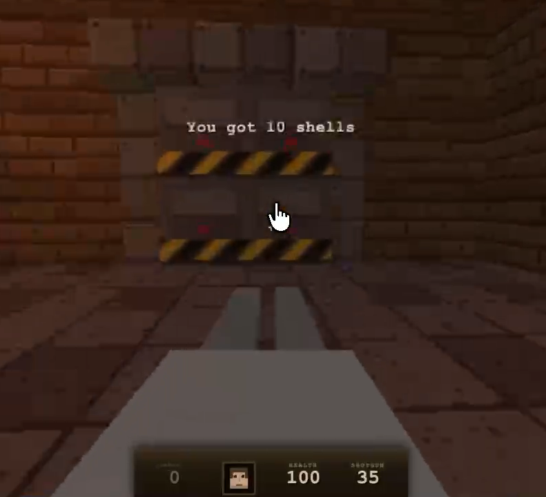

# Quake Game

Ask LLM to create a browser playable version of the classic Quake game!

## Prompt

I kept the prompt very simple

```
create the game of 'quake'
- must be interactively playable on a web browser
- single player, one level
- mimic original graphics and aesthetics

do you need any clarifications?
```

## Coding stack

I used various coding agents + models

Coding agents:
- Claude Code
- OpenCode

## Game  1: OpenCode + Kimi K3

Here is a really cool playable version created by Kimi K3

[Play live!](https://sujee.github.io/practical-llm-evals/fun/quake/opencode-kimi-k3/index.html)

[](https://sujee.github.io/practical-llm-evals/fun/quake/opencode-kimi-k3/index.html)

▶️ [Watch on YouTube](https://www.youtube.com/watch?v=6IzVFtnOm9A)

